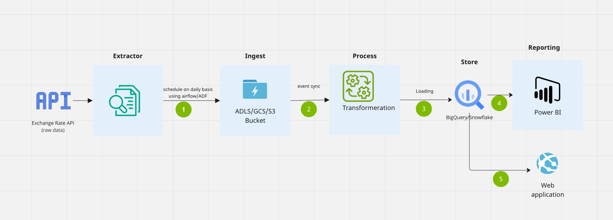

# Task 2: Data Architecture and Pipeline Design

## Data Pipeline Design:

## Explanation for the stages

## Overview:
- This pipeline design follows an ETL (Extract, Transform, Load) approach, where data is first extracted, transformed, and then loaded.
- Scheduling the data extraction ensures daily dumping of data into the data lake.
- After successful extraction, it will trigger the transformation and then load it into the data warehouse.

### The data pipeline will consist of the following stages:

### Data Extraction:

- This stage utilizes the script from Task 1 to fetch daily exchange rates from the external API ([Exchange Rates API](https://exchangeratesapi.io/)).
- The `extractor.py` module can be triggered daily using a scheduler like Cloud Scheduler or Airflow.
### Data Ingestion
- This stage stores the raw JSON files extracted by the extractor into data lake.
- The data is stored in a datewise folder structure.

### Data Process:
- The raw data retrieved from the API may require transformation before loading into data.
- This might involve cleaning, filtering, or reshaping the data.
- The `transformer.py` module can be used for this purpose.

### Data Loading:

- The transformed and validated data is loaded into the BigQuery table defined in `model.py`.
- The `loader.py` module can handle this stage using BigQuery's load functionality.

### Reporting:

- This stage involves querying the data warehouse to extract relevant information and presenting it in a comprehensible format, such as charts, graphs, or textual reports.